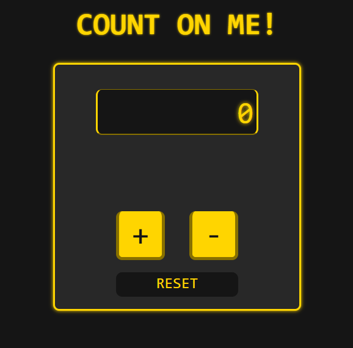

<div align="center">

# 🔢 Count on Me

### A minimal, keyboard-friendly counter app — built with vanilla JavaScript.

[](https://c-on-me.netlify.app/)



</div>

---

## 📋 Table of Contents

- **About the Project**
- **Features**
- **Built With**
- **Getting Started**
- **Usage**
- **Contacts**

---

## 📖 About the Project

**Count on Me** is a simple counter web application developed as a JavaScript DOM manipulation exercise. The entire UI — buttons, display, title — is created dynamically at runtime using pure JavaScript, with no HTML body markup and no frameworks involved.

The project goes beyond the basic requirements by adding persistent storage, min/max limits, keyboard support, and polished UI animations.

---

## ✨ Features

- ➕ **Increment / ➖ Decrement** the counter with on-screen buttons
- 💾 **Persistent storage** via `localStorage` — your count survives page reloads
- ⌨️ **Full keyboard support** — use `+`, `-`, `r` / `0`, and the Numpad
- 🔒 **Min / Max limits** (±999,999,999) with a shake animation when reached
- 🎨 **Animated feedback** — button press effect and container shake on limit hit
- 🧱 **100% dynamically generated UI** — no static HTML elements in the body

---

## 🛠️ Built With


- **Vanilla JavaScript** — DOM manipulation, `localStorage`, event listeners
- **No frameworks** — no jQuery, React, Angular, Vue, or any external dependencies

---

## 🚀 Getting Started

No installation or build step required.

### Run locally

```bash
git clone https://github.com/dm-square/count-on-me.git
cd count-on-me
```

Then open `index.html` in your browser — that's it.

> The project uses `defer` on the script tag, so no module bundler is needed.

---

## 🕹️ Usage

| Action | Mouse | Keyboard |
|---|---|---|
| Increment | Click `+` | `+` or `Numpad +` |
| Decrement | Click `−` | `-` or `Numpad -` |
| Reset | Click `Reset` | `r`, `0`, or `Numpad 0` |

The counter value is automatically saved to `localStorage` and restored on next visit.

---

## 👤 Contacts

Questions, feedback, or ideas? I’d love to hear from you! Visit my website: [dm-square.github.io](https://dm-square.github.io/)

---

<div align="center">
  <sub>Made with ☕ and vanilla JS</sub>
</div>
